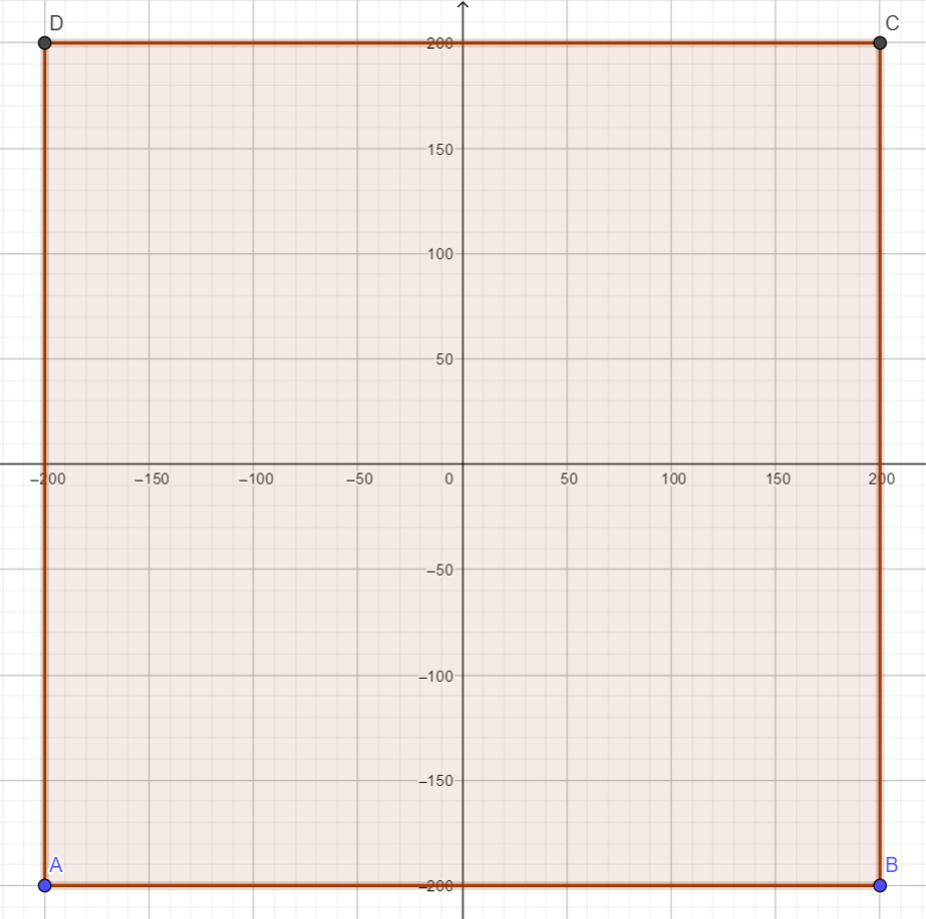

# turtle基本指令

## 一些常用的 turtle 方法

參考資料：[Turtle graphics](https://docs.python.org/3/library/turtle.html)

### 座標系

### 基本繪圖

`turtle.forward(100)`或`turtle.fd(100)`

> 往前100步

`turtle.backward(100)`或`turtle.bk(100)`

> 往後100步

`turtle.circle(50)`

> 畫一個半徑為 50 的圓, 圓心在 turtle 左邊。

`turtle.left(90)`或`turtle.lt(90)`

> 向左轉90度

`turtle.right(90)`或`turtle.rt(90)`

> 向右轉90度

`turtle.home()`

> 回到原點，turtle的角度設回 0

`turtle.goto(x, y)`

> 直接將 turtle 移至 (x, y) 的位置

`turtle.penup()`或`turtle.pu()`

> 提起畫筆

`turtle.pendown()`或`turtle.pd()`

> 放下畫筆，準備開始作畫

### 畫筆粗細及顏色

`turtle.bgcolor('green')`

> 設定背景顏色

`turtle.fillcolor('orange')`

> 設定填滿色彩

`turtle.pencolor('blue')`

> 設定畫筆顏色

`turtle.color('blue','orange')`

> 設定畫筆顏色為 blue, 填滿色彩為 orange。

`turtle.begin_fill()` + `turtle.end_fill()`

> 設定開始填滿及結束填滿。

`turtle.pensize(5)`

`turtle.width(5)`

> 設定爬行路線的寬度

### 其他控制

`turtle.shape('turtle')`

> 設定turtle的形狀

[`turtle.speed('fastest')`](https://docs.python.org/3/library/turtle.html#turtle.speed)

> 設定turtle的速度 0..10

`turtle.hideturtle()`

> 隱藏 turtle

`turtle.showturtle()`

> 顯示 turtle

